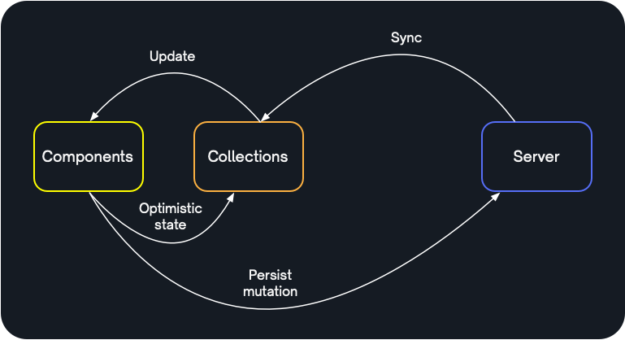

# TanStack DB - Documentation

Welcome to the TanStack DB documentation.

TanStack DB is a reactive client store for building super fast apps on sync. It extends TanStack Query with collections, live queries and optimistic mutations.

## Contents

- [How it works](#how-it-works) &mdash; understand the TanStack DB development model and how the pieces fit together
- [API reference](#api-reference) &mdash; for the primitives and function interfaces
- [Usage examples](#usage-examples) &mdash; examples of common usage patterns
- [More info](#more-info) &mdash; where to find support and more information

## How it works

TanStack DB works by:

- [defining collections](#defining-collections) typed sets of objects that can be populated with data
- [using live queries](#using-live-queries) to query data from/across collections
- [making optimistic mutations](#making-optimistic-mutations) using transactional mutators

```tsx
// Define collections to load data into
const todoCollection = createCollection({
  // your config
})

const Todos = () => {
  // Bind data using live queries
  const { data: todos } = useLiveQuery((query) =>
    query
      .from({ todoCollection })
      .where('@completed', '=', false)
  )

  // Make local writes using optimistic mutations
  const updateTodo = useOptimisticMutation({ mutationFn })

  const complete = (todo) =>
    // Invokes the mutationFn to handle the write
    updateTodo.mutate(() =>
      // Instantly applies optimistic state
      todoCollection.update(todo, (draft) => {
        draft.completed = true
      })
    )

  return (
    <ul>
      {todos.map(todo =>
        <li key={ todo.id } onClick={() => complete(todo) }>
          { todo.text }
        </li>
      )}
    </ul>
  )
}
```

### Defining collections

Collections are typed sets of objects that can be populated with data. They're designed to de-couple loading data into your app from binding data to your components.

Collections can be populated in many ways, including:

- fetching data, for example [from API endpoints using TanStack Query](#)
- syncing data, for example [using a sync engine like ElectricSQL](#)
- storing local data, for example [in-memory client data or UI state](#)
- from live collection queries, creating [derived collections as materialised views](#)

Once you have your data in collections, you can query across them using live queries in your components.

### Using live queries

Live queries are used to query data out of collections. Live queries are reactive: when the underlying data changes in a way that would affect the query result, the result is incrementally updated and returned from the query, triggering a re-render.

TanStack DB live queries are implemented using [d2ts](https://github.com/electric-sql/d2ts), a Typescript implementation of differential dataflow. This allows the query results to update *incrementally* (rather than by re-running the whole query). This makes them blazing fast, usually sub-millisecond, even for highly complex queries.

Live queries support joins across collections. This allows you to:

1. load normalised data into collections and then de-normalise it through queries; simplifying your backend by avoiding the need for bespoke API endpoints that match your client
2. join data from multiple sources; for example, syncing some data out of a database, fetching some other data from an external API and then joining these into a unified data model for your front-end code

### Making optimistic mutations

Collections support `insert`, `update` and `delete` operations. These operations must be made within the context of a transactional mutator:

```ts
const updateTodo = useOptimisticMutation({ mutationFn })

// Triggers the `mutationFn`
updateTodo.mutate(() =>
  // Immediately applies optimistic state
  todoCollection.update(todo, (draft) => {
    draft.completed = true
  })
)
```

Rather than mutating the collection data directly, the collection internally treats its synced/loaded data as immutable and maintains a separate set of local mutations as optimistic state. When live queries read from the collection, they see a local view that overlays the local optimistic mutations on-top-of the immutable synced data.

In addition, the local mutations are passed to the async `mutationFn` that's passed in when creating the mutator. This mutationFn is responsible for handling the writes, usually by sending them to a server or a database. TanStack DB waits for the function to resolve before then removing the optimistic state that was applied when the local writes was made.

For example, in the following code, the mutationFn first sends the write to the server using `await api.todos.update(updatedTodo)` and then calls `await collection.refetch()` to trigger a re-fetch of the collection contents using TanStack Query. When this second await resolves, the collection is up-to-date with the latest changes and the optimistic state is safely discarded.

```ts
const updateTodo = useOptimisticMutation({
  mutationFn: async ({ transaction }) => {
    const { collection, modified: updatedTodo } = transaction.mutations[0]!

    await api.todos.update(updatedTodo)
    await collection.refetch()
  },
})
```

The collection blocks applying updates while this function runs. The optimistic state is dropped at the exact same time as the backend state is applied. There's never any flicker in the UI.

### Uni-directional data flow

This combines to support a model of uni-directional data flow, extending the redux/flux style state management pattern beyond the client, to take in the server as well:

<figure>
  <a href="./unidirectional-data-flow.lg.png" target="_blank">
    
  </a>
</figure>

With an instant inner loop of optimistic state, superseded in time by the slower outer loop of persisting to the server and syncing the updated server state back into the collection.

## API reference

### Collections

There are a number of built-in collection types implemented in [`../packages/db-collections`](../packages/db-collections):

1. [`QueryCollection`](#querycollection) to load data into collections using [TanStack Query](https://tanstack.com/query)
2. [`ElectricCollection`](#electriccollection) to sync data into collections using [ElectricSQL](https://electric-sql.com)
3. [WIP] [`LocalCollection`](#localcollection) for in-memory client data or UI state

You can also use:

- use live collection queries to [derive collections from other collections](#derived-collections)
- the [base Collection](#base-collection) to define your own collection types

#### Collection schemas

All collections optionally support a `schema`.

If provided, this should be a [Standard Schema](https://standardschema.dev) compatible schema instance, such as a [Zod](https://zod.dev) or [Effect](https://effect.website/docs/schema/introduction/) schema.

#### `QueryCollection`

[TanStack Query](https://tanstack.com/query) fetches data using managed queries. Use `createQueryCollection` to fetch data into a collection using TanStack Query:

```ts
const todoCollection = createQueryCollection({
  queryKey: ['todoItems'],
  queryFn: async () => fetch('/api/todos'),
  getId: (item) => item.id,
  schema: todoSchema // any standard schema
})
```

The collection will be populated with the query results.

#### `ElectricCollection`

[Electric](https://electric-sql.com) is a read-path sync engine for Postgres. It allows you to sync subsets of data out of a Postgres database, [through your API](https://electric-sql.com/blog/2024/11/21/local-first-with-your-existing-api), into a TanStack DB collection.

Electric's main primitive for sync is a [Shape](https://electric-sql.com/docs/guides/shapes). Use `createElectricCollection` to sync a shape into a collection:

```ts
import { createElectricCollection } from '@tanstack/db-collections'

export const todoCollection = createElectricCollection<Todo>({
  id: 'todos',
  streamOptions: {
    url: 'https://example.com/v1/shape',
    params: {
      table: 'todos'
    }
  },
  primaryKey: ['id'],
  schema: todoSchema
})
```

The Electric collection requires two Electric-specific options:

- `streamOptions` &mdash; the Electric [ShapeStreamOptions](https://electric-sql.com/docs/api/clients/typescript#options) that define the [Shape](https://electric-sql.com/docs/guides/shapes) to sync into the collection; this includes the
  - `url` to your sync engine; and
  - `params` to specify the `table` to sync and any optional `where` clauses, etc.
- `primaryKey` &mdash; identifies the primary key for the rows being synced into the collection

When you create the collection, sync starts automatically.

Electric shapes allow you to filter data using where clauses:

```ts
export const myPendingTodos = createElectricCollection<Todo>({
  id: 'todos',
  streamOptions: {
    url: 'https://example.com/v1/shape',
    params: {
      table: 'todos',
      where: `
        status = 'pending'
        AND
        user_id = '${user.id}'
      `
    }
  },
  primaryKey: ['id'],
  schema: todoSchema
})
```

> [!TIP]
> Shape where clauses, used to filter the data you sync into `ElectricCollection`s, are different from the [live queries](#live-queries) you use to query data in components.
>
> Live queries are much more expressive than shapes, allowing you to query across collections, join, aggregate, etc. Shapes just contain filtered database tables and are used to populate the data in a collection.

If you need more control over what data syncs into the collection, Electric allows you to [use your API](https://electric-sql.com/blog/2024/11/21/local-first-with-your-existing-api#filtering) as a proxy to both authorise and filter data.

See the [Electric docs](https://electric-sql.com/docs/intro) for more information.

#### `LocalCollection`

This is WIP. Track progress at [#79](https://github.com/TanStack/db/issues/79).

#### Derived collections

Live queries return collections. This allows you to derive collections from other collections.

For example:

```ts
import { compileQuery, queryBuilder } from "@tanstack/db"

// Imagine you have a collections of todos.
const todoCollection = createCollection({
  // config
})

// You can derive a new collection that's a subset of it.
const query = queryBuilder()
  .from({ todoCollection })
  .where('@completed', '=', true)

const compiled = compileQuery(query)
compiled.start()

const completedTodoCollection = compiledQuery.results()
```

This also works with joins to derive collections from multiple source collections. And it works recursively -- you can derive collections from other derived collections. Changes propagate efficiently using differential dataflow and it's collections all the way down.

#### base Collection

There is a base `Collection` class in [`../packages/db/src/collection.ts`](../packages/db/src/collection.ts). You can use this directly or as a base class for implementing your own collection types.

See the existing implementations in [`../packages/db-collections`](../packages/db-collections) for reference.

### Live queries

#### `useLiveQuery` hook

Use the `useLiveQuery` hook to assign live query results to a state variable in your React components:

```ts
import { useLiveQuery } from '@tanstack/react-db'

const Todos = () => {
  const { data: todos } = useLiveQuery(query =>
    query
      .from({ todoCollection })
      .where('@completed', '=', false)
      .orderBy({'@created_at': 'asc'})
      .select('@id', '@text')
      .keyBy('@id')
  )

  return <List items={ todos } />
}
```

You can also query across collections with joins:

```ts
import { useLiveQuery } from '@tanstack/react-db'

const Todos = () => {
  const { data: todos } = useLiveQuery(query =>
    query
      .from({ todos: todoCollection })
      .join({
        type: `inner`,
        from: { lists: listCollection },
        on: [`@lists.id`, `=`, `@todos.listId`],
      })
      .where('@lists.active', '=', true)
      .select(`@todos.id`, `@todos.title`, `@lists.name`)
      .keyBy('@id')
  )

  return <List items={ todos } />
}
```

#### `queryBuilder`

You can also build queries directly (outside of the component lifecycle) using the underlying `queryBuilder` API:

```ts
import { compileQuery, queryBuilder } from "@tanstack/db"

const query = queryBuilder()
  .from({ todoCollection })
  .where('@completed', '=', true)

const compiled = compileQuery(query)
compiled.start()

const results = compiledQuery.results()
```

Note also that:

1. the query results [are themselves a collection](#derived-collections)
2. the `useLiveQuery` automatically starts and stops live query subscriptions when you mount and unmount your components; if you're creating queries manually, you need to manually manage the subscription lifecycle yourself

See the [query-builder tests](../packages/db/tests/query/query-builder) for many more usage examples.

### Transactional mutators

Transactional mutators allow you to batch and stage local changes across collections with:

- immediate application of local optimistic updates
- flexible mutationFns to handle writes, with automatic rollbacks and management of optimistic state

#### `mutationFn`

Mutators are created with a `mutationFn`. You can define a single, generic `mutationFn` for your whole app. Or you can define collection or mutation specific functions.

The `mutationFn` is responsible for handling the local changes and processing them, usually to send them to a server or database to be stored, e.g.:

```tsx
import type { MutationFn } from '@tanstack/react-db'

const mutationFn: MutationFn = async ({ transaction }) => {
  const response = await api.todos.create(transaction.mutations)

  if (!response.ok) {
    // Throwing an error will rollback the optimistic state.
    throw new Error(`HTTP Error: ${response.status}`)
  }

  const result = await response.json()

  // Wait for the transaction to be synced back from the server
  // before discarding the optimistic state.
  const collection: Collection = transaction.mutations[0]!.collection
  await collection.refetch()
}
```

#### `useOptimisticMutation`

Use the `useOptimisticMutation` hook with your `mutationFn` to create a mutator that you can use to mutate data in your components:

```tsx
import { useOptimisticMutation } from '@tanstack/react-db'

const Todo = () => {
  // Create the `addTodo` mutator, passing in your `mutationFn`.
  const addTodo = useOptimisticMutation({ mutationFn })

  const handleClick = () => {
    // Triggers the mutationFn
    addTodo.mutate(() =>
      // Instantly applies the local optimistic state.
      todoCollection.insert({
        id: uuid(),
        text: '🔥 Make app faster',
        completed: false
      })
    )
  }

  return <Button onClick={ handleClick } />
}
```

Transaction lifecycles can be manually controlled:

```ts
const addTodo = useOptimisticMutation({ mutationFn })
const tx = addTodo.createTransaction()

tx.mutate(() => {}

// user reviews change

// Another mutation
tx.mutate(() => {}

// Mutation is approved
tx.commit()
```

Transactions progress through the following states:

1. `pending`: Initial state when a transaction is created and optimistic mutations can be applied
2. `persisting`: Transaction is being persisted to the backend
3. `completed`: Transaction has been successfully persisted
4. `failed`: An error was thrown while persisting or syncing back the Transaction

#### Write operations

Collections support `insert`, `update` and `delete` operations. These operations must be made within the context of a transactional mutator:

```ts
const updateTodo = useOptimisticMutation({ mutationFn })
updateTodo.mutate(() =>
  // Make write operations here, e.g.:
  todoCollection.update(todo, (draft) => {
    draft.completed = true
  })
)
```

##### `insert`

```typescript
// Insert a single item
myCollection.insert({ text: "Buy groceries", completed: false })

// Insert multiple items
insert([
  { text: "Buy groceries", completed: false },
  { text: "Walk dog", completed: false },
])

// Insert with custom key
insert({ text: "Buy groceries" }, { key: "grocery-task" })
```

##### `update`

We use a proxy to capture updates as immutable draft optimistic updates.

```typescript
// Update a single item
update(todo, (draft) => {
  draft.completed = true
})

// Update multiple items
update([todo1, todo2], (drafts) => {
  drafts.forEach((draft) => {
    draft.completed = true
  })
})

// Update with metadata
update(todo, { metadata: { reason: "user update" } }, (draft) => {
  draft.text = "Updated text"
})
```

##### `delete`

```typescript
// Delete a single item
delete todo

// Delete multiple items
delete [todo1, todo2]

// Delete with metadata
delete (todo, { metadata: { reason: "completed" } })
```

## Usage examples

Here we illustrate two common ways of using TanStack DB:

1. [using TanStack Query](#1-tanstack-query) with an existing REST API
2. [using the ElectricSQL sync engine](#2-electricsql-sync) with a generic ingestion endpoint

> [!TIP]
> You can combine these patterns. One of the benefits of TanStack DB is that you can integrate different ways of loading data and handling mutations into the same app. Your components don't need to know where the data came from or goes.

### 1. TanStack Query

You can use TanStack DB with your existing REST API via TanStack Query.

The steps are to:

1. create [`QueryCollection`](#querycollection)s that load data using TanStack Query
2. implement [`mutationFn`](#mutationfn)s that handle mutations by posting them to your API endpoints

```tsx
import { useLiveQuery, useOptimisticMutation } from "@tanstack/react-db"
import { createQueryCollection } from "@tanstack/db-collections"

// Load data into collections using TanStack Query.
// It's common to define these in a `collections` module.
const todoCollection = createQueryCollection<Todo>({
  queryKey: ["todos"],
  queryFn: async () => fetch("/api/todos"),
  getId: (item) => item.id,
  schema: todoSchema, // any standard schema
})
const listCollection = createQueryCollection<TodoList>({
  queryKey: ["todo-lists"],
  queryFn: async () => fetch("/api/todo-lists"),
  getId: (item) => item.id,
  schema: todoListSchema
})

const Todos = () => {
  // Read the data using live queries. Here we show a live
  // query that joins across two collections.
  const { data: todos } = useLiveQuery((query) =>
    query
      .from({ t: todoCollection })
      .join({
        type: 'inner',
        from: { l: listCollection },
        on: [`@l.id`, `=`, `@t.list_id`]
      })
      .where('@l.active', '=', true)
      .select('@t.id', '@t.text', '@t.status', '@l.name')
      .keyBy('@id')
  )

  // Handle local writes by sending them to your API.
  // Note that the mutator is defined with a mutationFn that's
  // specific to the collection type and the write operation.
  //
  // Having a `mutationFn` per type+operation provides a natural
  // extension point to add things like side-effects and
  // instrumentation later on when your app grows.
  const addTodo = useOptimisticMutation({
    mutationFn: async ({ transaction }) => {
      const { changes: newTodo } = transaction.mutations[0]!

      // Handle the local write by sending it to your API.
      await api.todos.create(newTodo)

      // Tell TanStack Query to re-fetch the collection data.
      // This blocks until the collection is up-to-date.
      // The local app avoids flickering and always converges
      // on the server state as the source of truth.
      await todoCollection.refetch()
    },
  })

  // Here we define another mutator with its own specific mutationFn.
  // This knows the api call to make and the collection to refetch.
  const addList = useOptimisticMutation({
    mutationFn: async ({ transaction }) => {
      const { changes: newList } = transaction.mutations[0]!

      await api.todoLists.create(newList)
      await todoListCollection.refetch()
    },
  })

  // ...

}
```

This pattern allows you to extend an existing TanStack Query application, or any application built on a REST API, with blazing fast, cross-collection live queries and local optimistic mutations with automatically managed optimistic state.

### 2. ElectricSQL sync

One of the most powerful ways of using TanStack DB is with a sync engine, for a fully local-first experience with real-time sync. This allows you to incrementally adopt sync into an existing app, whilst still handling writes with your existing API.

Here, we illustrate this pattern:

- using [ElectricSQL](https://electric-sql.com) as the sync engine; and
- POSTing mutations to a generic `/ingest/mutations` endpoint

```tsx
import type { Collection } from '@tanstack/db'
import type { MutationFn, PendingMutation } from '@tanstack/react-db'
import { createElectricCollection } from '@tanstack/db-collections'

export const todoCollection = createElectricCollection<Todo>({
  id: 'todos',
  schema: todoSchema,
  // Electric syncs data using "shapes". These are filtered views
  // on database tables that Electric keeps in sync for you.
  streamOptions: {
    url: 'https://api.electric-sql.cloud/v1/shape',
    params: {
      table: 'todos'
    }
  },
  primaryKey: ['id'],
  schema: todoSchema
})

// Define a generic `mutationFn` that handles all mutations and
// POSTs them to a backend ingestion endpoint.
const mutationFn: MutationFn = async ({ transaction }) => {
  const payload = transaction.mutations.map((mutation: PendingMutation) => {
    const { collection: _, ...rest } = mutation

    return rest
  })

  const response = await fetch('/ingest/mutations', {
    method: 'POST',
    headers: {
      'Content-Type': 'application/json',
    },
    body: JSON.stringify(payload)
  })

  if (!response.ok) {
    // Throwing an error will rollback the optimistic state.
    throw new Error(`HTTP Error: ${response.status}`)
  }

  const result = await response.json()

  // Wait for the transaction to be synced back from the server
  // before discarding the optimistic state.
  const collection: Collection = transaction.mutations[0]!.collection

  // Here we use an ElectricSQL feature to monitor the incoming sync
  // stream for the database transaction ID that the writes we made
  // were applied under. When this syncs through, we can safely
  // discard the local optimistic state.
  await collection.awaitTxId(result.txid)
}

// We can now use the same mutationFn for any local write operations.
const AddTodo = () => {
  const addTodo = useOptimisticMutation({ mutationFn })

  return (
    <Button
      onClick={() =>
        addTodo.mutate(() =>
          todoCollection.insert({
            id: uuid(),
            text: "🔥 Make app faster",
            completed: false
          })
        )
      }
    />
  )
}
```

The key requirements for the server in this case are:

1. to be able to parse and ingest the payload format
2. to return the database transaction ID that the changes were applied under; this then allows the mutationFn to monitor the replication stream for that `txid`, at which point the local optimistic state is discarded

> [!TIP]
> One reference implementation of a backend designed to ingest changes from TanStack DB is the [`Phoenix.Sync.Writer`](https://hexdocs.pm/phoenix_sync/Phoenix.Sync.Writer.html) module from the [Phoenix.Sync](https://hexdocs.pm/phoenix_sync) library for the [Phoenix web framework](https://www.phoenixframework.org).

## More info

If you have questions / need help using TanStack DB, let us know on the Discord or start a GitHub discussion:

- [`#db` channel in the TanStack discord](https://discord.gg/yjUNbvbraC)
- [GitHub discussions](https://github.com/tanstack/db/discussions)
